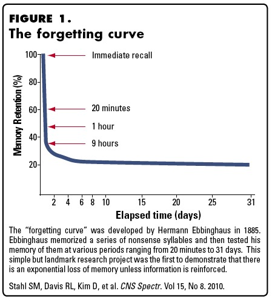
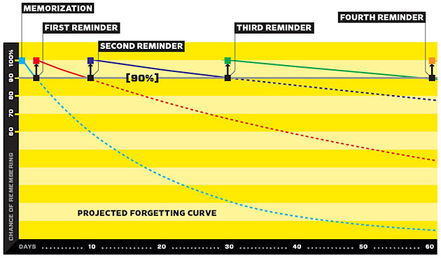

# Recordar  [](https://circleci.com/gh/franciscop/recordar) 

A spaced repetition algorithm to analyze several responses from the students and give an approximate score of how much they remember the concept. Example:

```js
const recordar = require('recordar');
const time = require('to-date');

const answers = [
  { type:  'bad', time: time(1).hour.ago },
  { type: 'good', time: time(50).minutes.ago },
  { type: 'good', time: time(1).minute.ago }
];
const options = {};

recordar(answers, options).then(score => {
  console.log(score);  // 0.6014866641343918
});
```

It can be either several tries of the same item, several items of the same concept or a combination of both. It is useful to calculate which word/question should be prompted next in a set: use the one with the lowest score.


## Getting started

Install it with npm as usual:

```js
npm install recordar --save
```

Then just `require('recordar')` it.

It is designed so you can plug it easily into your system. For instance, if you want to analyze from a flashcard list you could do:

```js
const recordar = require('recordar');

const assignScore = word => recordar(word.answers).then(score => {
  return Object.assign({}, word, { score });
});

// "words" is your own variable of [{ ..., answers: [], }, { ..., answers: [] }]
Promise.all(words.map(assignScore)).then(words => {
  // Here each word in words has its score set as word.score
});
```

> Note: a wrapper library will probably follow for picking a specific word taking into account several extra factors: index in set and student mood (to avoid *bad luck strikes*).


## Options

So far there are 2 options, and they both seem to work quite well out of the box:

- `halflife` [3600]: the time on average so that your memory has forgotten half of the word. Defaults to 1h (3600s). For easy courses or with a previous review it is recommended to change it to a higher value `7200` (easy to remember). For difficult courses change it to a lower value `1200` (easy to forget).
- `minimum` [0.5]: the minimum amount that old answers influence on the good/wrong ratio. Newer ones follow their own rules, so this is just the minimum influence for old answers. Recommended to keep the default.


## Logic

A lot has been said about [spaced repetition before (please read this, it's awesome)](https://www.gwern.net/Spaced%20repetition) so I won't go into detail about the why of it or its history. Instead, I will explain briefly here what is considered for each response.


### Forget

The concept is easy, the memory retention depends on how long ago you studied the concept:



> Stahl et al 2010; CNS Spectr


The main idea is that, when some time passes and just at the right time before you start to forget the concept but not too early (or it'd be repetitive), the concept pops up and you are reminded about it:



By using [this equation `1 - ln(x) / (2 * ln(HALFLIFE))`](https://www.wolframalpha.com/input/?i=1+-+ln%5Bx%5D+%2F+%5B2+*+ln%5B3600%5D%5D+from+0+to+5000) we can also regulate the decay speed; the harder the content of each individual test, the shorter the retention rate (shorter half-life).


### Accuracy

This one is for **analyzing their retention rate for the specific item**.

Do you think a Spaniard person learning Italian would have the same decay graph as the same person studying Japanese? Or people studying their 5th language as people studying their 2nd?

The previous point was about the brain in general, but we are dealing with specific people, backgrounds and items. The good thing is that you can personalize it for every student-item pair!

This point takes into account the amount of right answers vs wrong answers. However this is not enough, since these would be the same:

1. [new] ✔ ✔ ✔ ✘ ✔ ✔ ✘ ✘ ✔ ✘ ✘ [old]
2. [new] ✘ ✔ ✘ ✔ ✔ ✘ ✔ ✔ ✘ ✔ ✘ [old]

They are also time-correlated; the more recent answers have more importance than the older ones.

Lastly, there is a small gap in the beginning to avoid making them *too* consecutive.


### Duration

> NOTE: not yet implemented

The total time the students spends with a particular concept should influence on how much they know it.


### Random

Facebook. Instagram. Snapchat. All have in common something I read on [Hooked: How to Build Habit-Forming Products](https://www.amazon.com/Hooked-How-Build-Habit-Forming-Products/dp/1591847788): they get randomized interval notifications. Make them too often and they are annoying, make them to sparsely and the user doesn't engage. But I digress, how to apply this to learning?

There's a small random factor to add some variation. This is not noticeable in 99% of the situations, but it avoids deadlocks in some cases where you are fighting 2 concepts with a string of negatives so they are not the only ones appearing.


## Closing thoughts

This is just the beginning; by doing this we are optimizing learning each item, but there is still a lot to do. We don't want to optimize for *one item*, but for *learning concepts or subjects*, so there should be a wrapping library for this one that acts as the general guide. Ideas:

- Is the ratio of right/wrong related to user engagement? If so, could we tweak it to keep the ratio balanced to optimize for longer study time?
- Does the time of the day or other habits influence on the method of study?
- For me there is a quick-review (swiping on the train) and an in-depth review (with paper and pen). This should be accounted somehow, but not sure if it can be done at this level or it should be done at the level above.
- Machine learning! I'm pretty sure this is the perfect situation for machine learning. I have already few thousands evaluations from my own, but I'd love to be able to get them from other people.

That's it, any question please open an issue.
